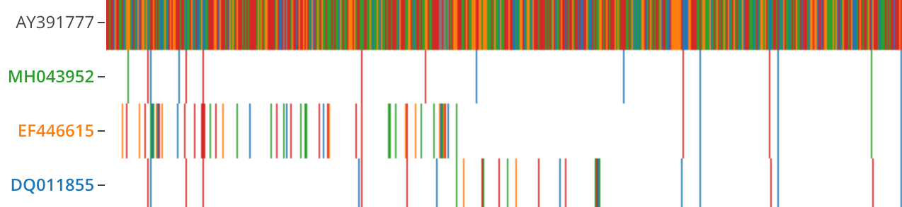
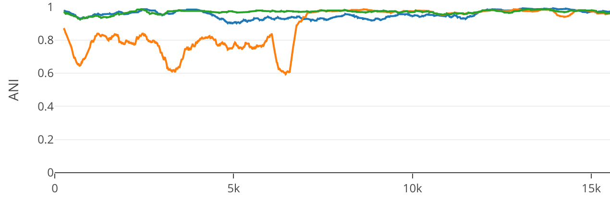
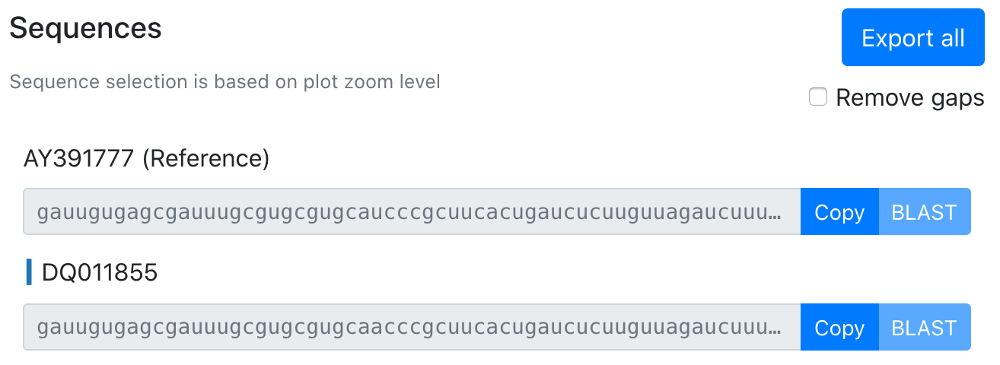
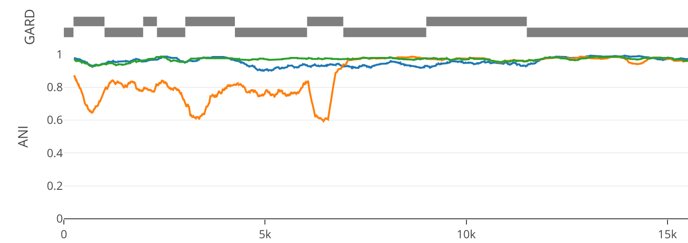
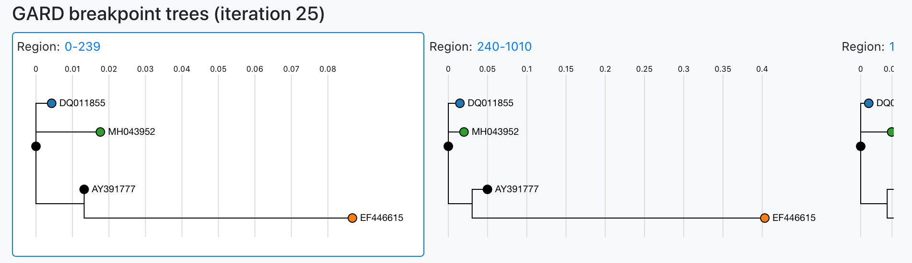
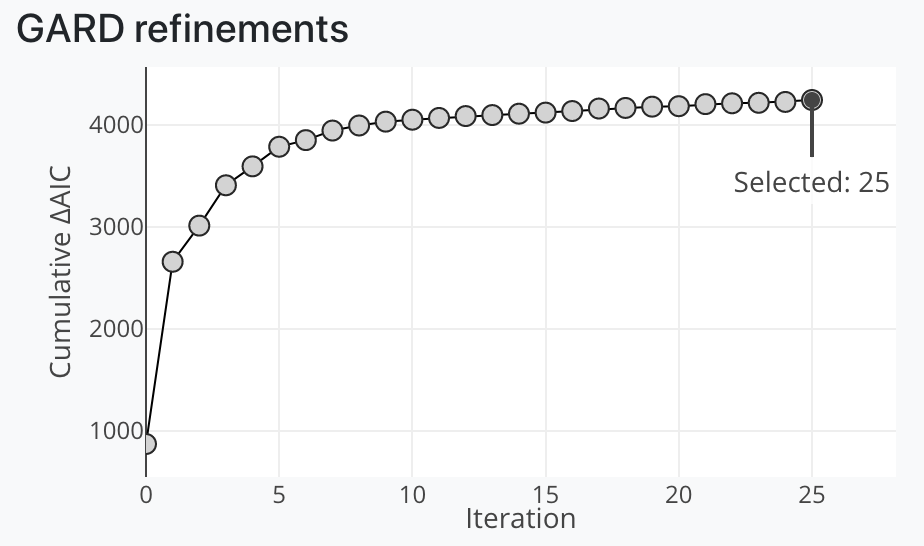

Compare similar sequences (\*.fasta) to a reference (.fasta).

See the example report at: https://brwnj.github.io/idplot/

# Setup

Nextflow is used to run the pipeline. Its installation instructions
can be found at https://www.nextflow.io/ or installed via [conda](https://docs.conda.io/projects/conda/en/latest/user-guide/install/) by
way of [bioconda](https://bioconda.github.io/user/install.html). Bioconda
includes a complete setup guide at https://bioconda.github.io/user/install.html.

Once your install completes and your channels are configured, run:

```
conda install nextflow
```

# Usage

Executing the workflow using nextflow:

```
nextflow run brwnj/idplot -latest -profile docker \
    --reference data/MN996532.fasta \
    --fasta 'data/query_seqs/*.fasta'
```

This generally takes only a few minutes to complete which enables rapid
screening for localized sequence similarity.

## Parameters

The reference sequence (`--reference`) should be a fasta with only one
sequence in it. Query sequences (`--fasta`) may either be single sequence
files or multi-sequence fasta files and you can specify more than one
using wildcards ('\*').

Example sequences are found in `data/query_sequences`.

By default, output is written to `./results/idplot.html` and can
be opened with an internet browser.

An example report is available at: https://brwnj.github.io/idplot/

## Including breakpoint detection

We have opted to employ GARD via [HyPhy](https://github.com/veg/hyphy) to
identify breakpoints. For each GARD fit iteration, we pull the sequences
for each breakpoint and build a tree using [FastTree](https://journals.plos.org/plosone/article?id=10.1371/journal.pone.0009490).

An example command enabling GARD with 12 MPI processes:

```
nextflow run brwnj/idplot -latest -profile docker \
    --reference data/MN996532.fasta \
    --fasta 'data/query_seqs/*.fasta' \
    --gard --cpus 12
```

# Interpreting the report

## Multiple sequence alignment



The reference sequence is fully colored in. Hovering along the reference
shows the base for a given color.

Query sequences are colored at mismatches and gaps (gray).

## Percent ID (ANI)



Percent ID is calculated across the window (default 500 bp) with the
value being plotted at the center point. A 500 bp window will have 250
bp dead spots at the beginning and end of the reference length. No
special treatment is given with respect to sequence content.

## Sequences



Sequence selection is based on the level of x-axis zoom of the plot. Sequence gaps can be removed using the toggle. The selected region can be copied to clipboard, sent directly to BLAST (when selection length is less than 8kb), or all sequences for a given region can be exported to FASTA.

## With GARD results

Including `--gard` in your nextflow command adds breakpoint detection and updates available data and visualizations in the report.

### Breakpoints track



Regions identified by GARD as breakpoints are highlighted between the
MSA and ANI plots. Clicks on the regions will navigate to the respective dendrogram.

### Dendrograms



Per region dendrograms are generated using [FastTree](https://journals.plos.org/plosone/article?id=10.1371/journal.pone.0009490) based off of regions identified by GARD.

Hovering over regions highlights the respective region in the GARD breakpoints track.

Clicking the region link will zoom the plot to facilitate downloading the sequence content for a given region.

### Refinements



Breakpoints are identified over iterations by GARD, often to an unhelpful degree. This plot allows the user to explore breakpoints and trees across all GARD iterations. Selecting a new point will update the dendrograms and GARD breakpoints track.
